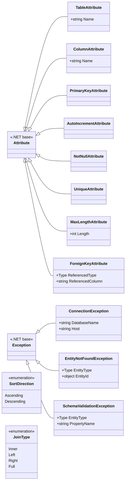
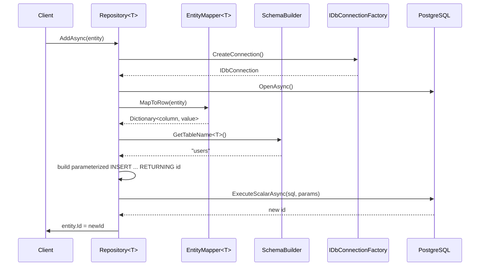
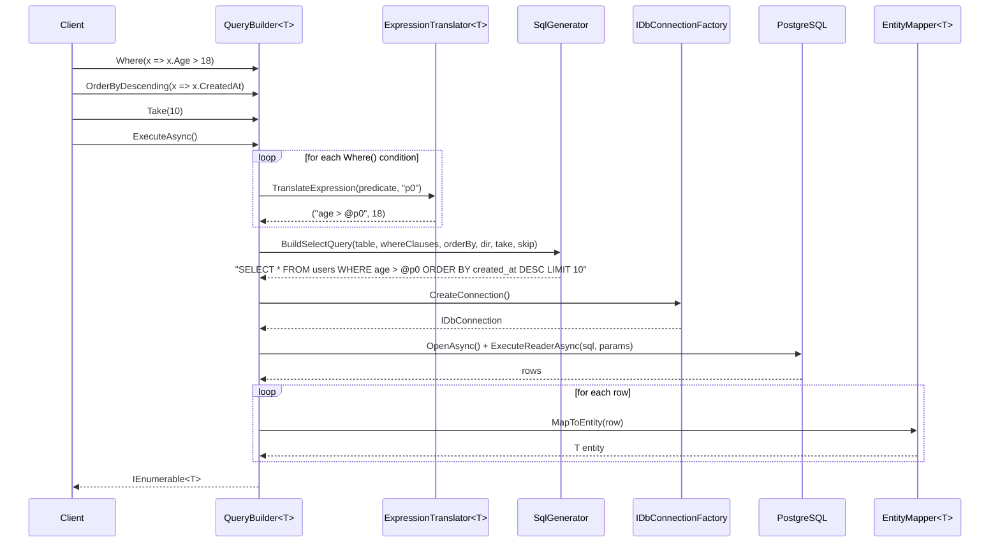
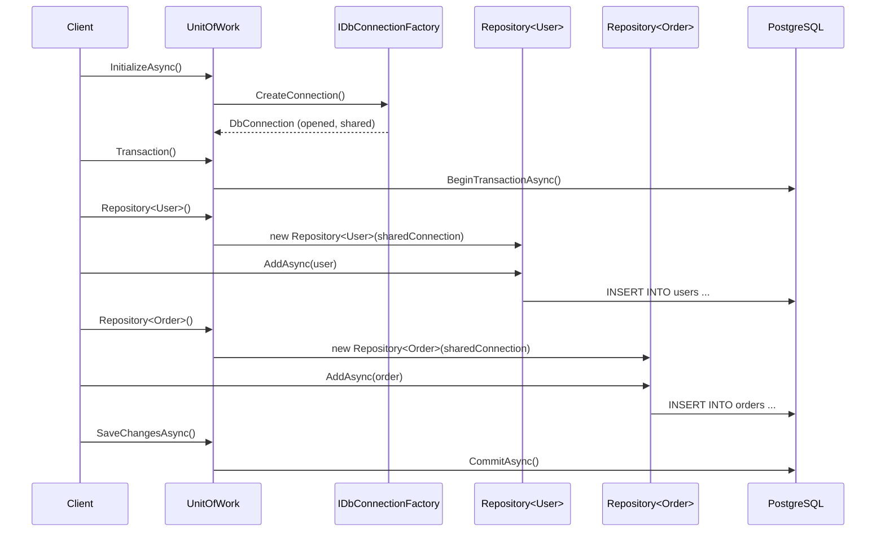
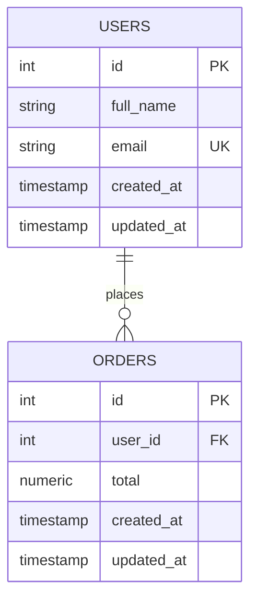
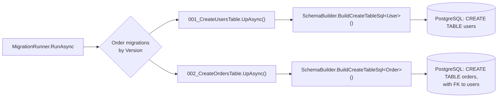

# NpgLiteORM — Architecture & Design Documentation

> A lightweight, educational **Object-Relational Mapper (ORM)** for PostgreSQL, built in C# / .NET 10 on top of Npgsql.
> This document provides an in-depth technical walkthrough of the codebase: its architecture, design patterns, class relationships, and the object-oriented principles it demonstrates.


---

## Getting Started

### Prerequisites

- .NET 10 SDK
- Docker (for running PostgreSQL locally)

### Run PostgreSQL locally

```bash
docker compose up -d
```

### Run the demo project

```bash
cd NpgLiteORM.Demo
dotnet run
```


---
## Overview

NpgLiteORM lets you map C# classes to PostgreSQL tables using attributes, then interact with your database through objects instead of writing raw SQL manually.

```csharp
[Table("users")]
public class User : EntityBase
{
    [PrimaryKey, AutoIncrement]
    public int Id { get; set; }

    [Column("full_name"), NotNull, MaxLength(100)]
    public string Name { get; set; }

    [Unique]
    public string Email { get; set; }
}
```

---


## 1. Executive Summary

**NpgLiteORM** is a hand-rolled micro-ORM that lets developers map plain C# classes to PostgreSQL tables using attributes (`[Table]`, `[Column]`, `[PrimaryKey]`, `[ForeignKey]`, etc.) and interact with the database through strongly-typed repositories and a fluent, LINQ-style query builder — instead of writing raw SQL by hand.

What makes this project noteworthy from an engineering standpoint is **not** the size of the codebase, but the **discipline of its design**. It is deliberately structured as a teaching artifact for the four pillars of OOP, and it shows a working knowledge of patterns that real-world ORMs (Entity Framework, Dapper, NHibernate) use internally:

| Pillar / Pattern | Where it appears |
|---|---|
| **Abstraction** | `RepositoryBase<T>`, `DbConnectionBase`, `EntityBase` hide *how* persistence happens behind a stable contract |
| **Encapsulation** | Reflection, SQL string building, and parameter binding are hidden inside `EntityMapper`, `SchemaBuilder`, `SqlGenerator` |
| **Inheritance** | `Repository<T> : RepositoryBase<T>`, `PostgresConnectionFactory : DbConnectionBase`, all entities `: EntityBase` |
| **Polymorphism** | `IDbConnectionFactory`, `IRepository<T>`, `IQueryBuilder<T>`, `IUnitOfWork` — swappable implementations behind interfaces |
| **Repository Pattern** | `Repository<T>` / `IRepository<T>` |
| **Unit of Work Pattern** | `UnitOfWork` — coordinates repositories + transactions over one shared connection |
| **Builder / Fluent Interface** | `QueryBuilder<T>` — `Where().OrderBy().Take().Skip().ExecuteAsync()` |
| **Factory Pattern** | `IDbConnectionFactory` / `PostgresConnectionFactory` |
| **Strategy-like Translation** | `ExpressionTranslator<T>` converts LINQ expression trees into SQL fragments |
| **Data Mapper Pattern** | `EntityMapper<T>` — converts between POCOs and `IDataRecord` rows |
| **Custom Exception Hierarchy** | `ConnectionException`, `EntityNotFoundException`, `SchemaValidationException` |
| **Attribute-Driven Metadata** | `TableAttribute`, `ColumnAttribute`, `PrimaryKeyAttribute`, `ForeignKeyAttribute`, `UniqueAttribute`, `NotNullAttribute`, `MaxLengthAttribute`, `AutoIncrementAttribute` |

The result reads like a **miniature, correctly-layered version of Entity Framework Core** — connection factory → schema/mapping layer → query layer → repository/unit-of-work layer — which is a genuinely difficult architecture to get right, especially the interplay between reflection-based mapping and expression-tree parsing.

---

## 2. Tech Stack

- **.NET 10** / **C# 12**
- **PostgreSQL**, accessed through **Npgsql**
- **Docker Compose** for local database provisioning
- **GitHub Actions** for continuous integration (see §15)
- Layered solution: `NpgLiteORM.Core` (library), `NpgLiteORM.Demo` (console showcase), `NpgLiteORM.Tests` (unit + integration tests for mapping, schema, expression translation, and repositories)

---

## 3. Project / Solution Structure

```
NpgLiteORM.Core/
├── Abstract/           EntityBase, RepositoryBase<T>, DbConnectionBase        (abstraction layer)
├── Attributes/          Table, Column, PrimaryKey, ForeignKey, Unique,
                          NotNull, MaxLength, AutoIncrement                     (declarative metadata)
├── Data/                PostgresConnectionFactory                             (connection creation)
├── Enums/                SortDirection, JoinType
├── Exceptions/           ConnectionException, EntityNotFoundException,
                          SchemaValidationException
├── Interfaces/           IDbConnectionFactory, IRepository<T>,
                          IQueryBuilder<T>, IUnitOfWork
├── Mapping/              EntityMapper<T>, SchemaBuilder                       (reflection engine)
├── Migrations/           IMigration, MigrationRunner                         (schema versioning)
├── Query/                QueryBuilder<T>, ExpressionTranslator<T>,
                          SqlGenerator                                         (fluent LINQ→SQL)
└── AttributeHelper.cs    Shared reflection helper

NpgLiteORM.Demo/
├── Models/               User, Order, Role                                    (sample entities)
└── Migrations/           001_CreateUsersTable, 002_CreateOrdersTable

NpgLiteORM.Tests/
├── Mapping/               EntityMapperTests, SchemaBuilderTests, FakeDataRecord
├── Query/                 ExpressionTranslatorTests
└── Repositories/          RepositoryTests

.github/workflows/
└── tests.yml             GitHub Actions CI: builds and runs the full test suite
                           against a fresh, disposable PostgreSQL service container
                           on every push and pull request to main
```

The layering is a clean **onion / clean-architecture shape**: `Attributes` and `Abstract` sit at the core with zero outward dependencies; `Mapping` and `Query` build on top of them via reflection; `Repositories` and `Migrations` orchestrate everything for the consumer; `Demo` and `Tests` depend on `Core` but never the reverse.

---

## 4. How It Works, End to End

1. **Define an entity** as a plain class inheriting `EntityBase`, decorated with `[Table]`, `[Column]`, `[PrimaryKey]`, `[NotNull]`, `[MaxLength]`, `[Unique]`, `[ForeignKey]`.
2. **`SchemaBuilder`** reflects over the type at runtime and generates the `CREATE TABLE` DDL, mapping C# types (`int`, `string`, `bool`, `DateTime`, `decimal`, `double`, `Guid`) to PostgreSQL column types, including `SERIAL`/`BIGSERIAL` for auto-increment keys — and throwing a typed **`SchemaValidationException`** (carrying the offending entity `Type` and property name) when an unsupported .NET type is encountered, instead of a generic `NotSupportedException`.
3. **`IMigration`** implementations (e.g. `CreateUsersTable`) use `SchemaBuilder` to apply/roll back that DDL; **`MigrationRunner`** applies all migrations in version order.
4. **`PostgresConnectionFactory`** (via `DbConnectionBase` → `IDbConnectionFactory`) is the single seam through which every other component obtains an `IDbConnection`, so the persistence provider could be swapped without touching business logic.
5. **`Repository<T>`** (implements `IRepository<T>`, extends `RepositoryBase<T>`) provides `AddAsync`, `GetByIdAsync`, `GetAllAsync`, `UpdateAsync`, `DeleteAsync`. It uses:
   - **`EntityMapper<T>`** to turn an entity into a column/value dictionary (`MapToRow`) and an `IDataRecord` back into an entity (`MapToEntity`), driven entirely by attribute reflection.
   - **`SchemaBuilder.GetTableName<T>()`** to resolve the physical table name.
   - Parameterized ADO.NET commands (`DbParameter`) everywhere — meaning **the library is SQL-injection-safe by construction** for all repository operations.
6. **`QueryBuilder<T>`** (implements `IQueryBuilder<T>`) offers a fluent LINQ-like API — `Where(x => x.Age > 18).OrderByDescending(x => x.CreatedAt).Take(10).ExecuteAsync()`. Internally:
   - **`ExpressionTranslator<T>`** walks the `Expression<Func<T,bool>>` tree and turns it into a parameterized `WHERE` fragment. It handles simple comparisons (`age > @p0`), compound predicates joined with `&&` / `||` / `!` (`(age > @p0 AND name = @p0_1)`), values captured from local variables/closures (`x.Age > minAge`), and `Contains`/`StartsWith`/`EndsWith` translated to `LIKE`.
   - **`SqlGenerator`** assembles the final `SELECT` statement (`WHERE`, `ORDER BY`, `LIMIT`, `OFFSET`) from those fragments — a clean separation between *"what to filter"* (translation) and *"how to write SQL"* (generation).
7. **`UnitOfWork`** (implements `IUnitOfWork`) opens one shared `DbConnection`, lazily creates/caches a `Repository<T>` per entity type via reflection (`Repository<>.MakeGenericType`), and coordinates `BeginTransaction` / `Commit` / `Rollback` across all of them — the classic Unit-of-Work pattern used by EF Core's `DbContext.SaveChanges()`.
8. **Domain-specific exceptions** (`EntityNotFoundException`, `ConnectionException`, `SchemaValidationException`) replace generic exceptions with typed, information-rich failures (e.g. `EntityNotFoundException` carries the entity `Type` and the missing `Id`; `SchemaValidationException` carries the entity `Type` and the offending property name).
9. **Every push to `main`** triggers **GitHub Actions** (§15), which spins up a disposable PostgreSQL container, restores, builds, and runs the entire test suite — including the integration tests against a real database — with zero manual steps.

---

## 5. Class Diagram — Core Domain & Abstractions

```mermaid
classDiagram
   direction TB

   class EntityBase {
      <<abstract>>
      +int Id
      +DateTime CreatedAt
      +DateTime UpdatedAt
   }

   class DbConnectionBase {
      <<abstract>>
      #string connectionString
      +CreateConnection() IDbConnection*
   }

   class RepositoryBase~T~ {
      <<abstract>>
      #IDbConnectionFactory connectionFactory
      +Validate(T entity) bool
   }

   class IDbConnectionFactory {
      <<interface>>
      +CreateConnection() IDbConnection
   }

   class IRepository~T~ {
      <<interface>>
      +GetByIdAsync(int id) Task~T~
      +GetAllAsync() Task~IEnumerable~T~~
      +AddAsync(T entity) Task
      +UpdateAsync(T entity) Task
      +DeleteAsync(int id) Task
   }

   class IQueryBuilder~T~ {
      <<interface>>
      +Where(predicate) IQueryBuilder~T~
      +OrderBy(keySelector) IQueryBuilder~T~
      +OrderByDescending(keySelector) IQueryBuilder~T~
      +Take(count) IQueryBuilder~T~
      +Skip(count) IQueryBuilder~T~
      +ExecuteAsync() Task~IEnumerable~T~~
   }

   class IUnitOfWork {
      <<interface>>
      +Repository~T~() IRepository~T~
      +Transaction() Task
      +SaveChangesAsync() Task
   }

   class PostgresConnectionFactory {
      +CreateConnection() IDbConnection
   }

   class Repository~T~ {
      -SchemaBuilder SchemaBuilder
      -EntityMapper~T~ Mapper
      -DbConnection sharedConnection
      +AddAsync(T entity) Task
      +GetAllAsync() Task~IEnumerable~T~~
      +GetByIdAsync(int id) Task~T~
      +UpdateAsync(T entity) Task
      +DeleteAsync(int id) Task
   }

   class QueryBuilder~T~ {
      -IDbConnectionFactory _connectionFactory
      -List~Expression~ _whereConditions
      -SchemaBuilder _schemaBuilder
      -EntityMapper~T~ _mapper
      -ExpressionTranslator~T~ _translator
      -SqlGenerator _sqlGenerator
      +Where(predicate) IQueryBuilder~T~
      +OrderBy(expr) IQueryBuilder~T~
      +OrderByDescending(expr) IQueryBuilder~T~
      +Take(count) IQueryBuilder~T~
      +Skip(count) IQueryBuilder~T~
      +ExecuteAsync() Task~IEnumerable~T~~
   }

   class UnitOfWork {
      -IDbConnectionFactory _connectionFactory
      -DbConnection _connection
      -DbTransaction _transaction
      -Dictionary~Type,object~ _repositories
      +InitializeAsync() Task
      +Repository~T~() IRepository~T~
      +Transaction() Task
      +SaveChangesAsync() Task
      +RollbackAsync() Task
   }

   class EntityMapper~T~ {
      +MapToRow(T entity) Dictionary~string,object~
      +MapToEntity(IDataRecord row) T
   }

   class SchemaBuilder {
      +BuildCreateTableSql~T~() string
      +GetTableName~T~() string
      -BuildColumnDefinition(property) string
      -MapCSharpTypeToSql(property) string
   }

   class ExpressionTranslator~T~ {
      +GetSqlOperator(nodeType) string
      +TranslateExpression(expr, paramName) (string, object)
   }

   class SqlGenerator {
      +BuildSelectQuery(table, where, orderBy, dir, take, skip) string
   }

   class AttributeHelper {
      <<static>>
      +GetColumnName(property) string
   }

   class IMigration {
      <<interface>>
      +Version int
      +Name string
      +UpAsync(connection) Task
      +DownAsync(connection) Task
   }

   class MigrationRunner {
      -DbConnection _connection
      +RunAsync(migrations) Task
   }

%% Inheritance
   DbConnectionBase ..|> IDbConnectionFactory
   PostgresConnectionFactory --|> DbConnectionBase
   RepositoryBase~T~ ..|> IRepository~T~ : (contract fulfilled by Repository~T~)
   Repository~T~ --|> RepositoryBase~T~
   Repository~T~ ..|> IRepository~T~
   QueryBuilder~T~ ..|> IQueryBuilder~T~
   UnitOfWork ..|> IUnitOfWork

%% Composition / usage
   RepositoryBase~T~ o-- IDbConnectionFactory : uses
   Repository~T~ *-- SchemaBuilder
   Repository~T~ *-- EntityMapper~T~
   QueryBuilder~T~ *-- SchemaBuilder
   QueryBuilder~T~ *-- EntityMapper~T~
   QueryBuilder~T~ *-- ExpressionTranslator~T~
   QueryBuilder~T~ *-- SqlGenerator
   QueryBuilder~T~ o-- IDbConnectionFactory : uses
   UnitOfWork o-- IDbConnectionFactory : uses
   UnitOfWork ..> Repository~T~ : creates via reflection
   EntityMapper~T~ ..> AttributeHelper : uses
   SchemaBuilder ..> AttributeHelper : uses
   ExpressionTranslator~T~ ..> AttributeHelper : uses
   MigrationRunner o-- IMigration : runs
   IMigration ..> SchemaBuilder : uses (in Demo migrations)

%% Entities
   Repository~T~ ..> EntityBase : constrained to
   QueryBuilder~T~ ..> EntityBase : constrained to
   EntityBase <|-- User
   EntityBase <|-- Order

   class User {
      +string Name
      +string Email
   }
   class Order {
      +int UserId
      +decimal Total
   }
```



---

## 6. Class Diagram — Attributes & Exceptions (Metadata Layer)



---

## 7. Sequence Diagram — `Repository<T>.AddAsync()`

Shows how attribute-driven reflection, the connection factory, and parameterized ADO.NET commands cooperate to insert a row safely.



---

## 8. Sequence Diagram — `QueryBuilder<T>.Where(...).OrderBy(...).ExecuteAsync()`

Shows how a LINQ expression becomes safe, parameterized SQL — the most technically interesting flow in the codebase.



---

## 9. Sequence Diagram — `UnitOfWork` Transaction Flow



---

## 10. Entity-Relationship View (Demo Domain)

Derived from the `[ForeignKey]` metadata on `Order.UserId` referencing `User`.



---

## 11. Migration Flow



---

## 12. Design Highlights — What This Codebase Demonstrates Well

- **Single Responsibility, taken seriously.** Each class does exactly one thing: `SchemaBuilder` only generates DDL, `SqlGenerator` only assembles `SELECT` statements, `ExpressionTranslator` only parses expression trees, `EntityMapper` only converts between objects and rows. None of these responsibilities bleed into each other.
- **Program to interfaces, not implementations.** `IDbConnectionFactory`, `IRepository<T>`, `IQueryBuilder<T>`, and `IUnitOfWork` mean the concrete Postgres/Npgsql dependency is isolated to a single class (`PostgresConnectionFactory`), making the design provider-agnostic in principle and easy to unit-test with fakes (see `NpgLiteORM.Tests/Mapping/FakeDataRecord.cs`).
- **Generics used correctly, not decoratively.** `RepositoryBase<T>`, `Repository<T>`, `QueryBuilder<T>`, `EntityMapper<T>`, `ExpressionTranslator<T>` all constrain `T` appropriately (`where T : EntityBase, new()`), giving compile-time safety without sacrificing reuse across every entity type.
- **Security by construction.** Every SQL statement across `Repository<T>` and `QueryBuilder<T>` is built with `DbParameter` bindings — there is no string-concatenated user input anywhere in the query path, which avoids SQL injection by design rather than by convention.
- **Reflection is centralized, not scattered.** All attribute lookups funnel through `AttributeHelper.GetColumnName()`, so column-naming behavior can change in one place.
- **Typed schema failures instead of generic ones.** Unsupported .NET-to-SQL type mappings raise a dedicated `SchemaValidationException` carrying the offending entity type and property name, rather than a bare `NotSupportedException` string.
- **Realistic pattern combination.** Repository + Unit of Work + Fluent Query Builder + Data Mapper is exactly the layering real ORMs use; combining them correctly (especially `UnitOfWork` creating typed repositories via `MakeGenericType` over one shared transaction) requires a solid grasp of generics, reflection, and ADO.NET transaction semantics simultaneously.
- **Typed, informative exceptions** over generic `Exception`/`InvalidOperationException` misuse — `EntityNotFoundException` and `ConnectionException` carry structured diagnostic data instead of just a message string.
- **Test coverage targets the hard parts.** Tests focus on `EntityMapper`, `SchemaBuilder`, and `ExpressionTranslator` — precisely the reflection- and expression-tree-heavy code that is easiest to get subtly wrong, showing an accurate sense of where the real risk lives.
- **Willingness to remove code, not just add it.** An earlier `ComparisonOperator` enum was deliberately removed once it became clear it duplicated .NET's own `ExpressionType` with no added value — a small but telling sign of engineering judgment over sunk-cost attachment to code already written.
- **Tests that assume nothing about environment state.** `RepositoryTests.InitializeAsync()` creates the schema itself (`SchemaBuilder.BuildCreateTableSql<User>()`) before truncating, rather than assuming a table already exists — a gap only surfaced by running the suite in a genuinely fresh environment (CI), which is exactly what continuous integration is for.

## 13. Known Limitations (as of this snapshot)

- `JoinType` is defined but not yet wired into `QueryBuilder<T>` / `SqlGenerator` — the groundwork for joins is laid but not yet consumed.
- `Role.cs` in the Demo project is currently an empty placeholder entity.
- No connection pooling/retry policy is implemented beyond what Npgsql provides by default.
- `ExpressionTranslator<T>` supports comparisons, `&&` / `||` / `!`, closures over local variables, and `.Contains()` / `StartsWith()` / `EndsWith()` (translated to `LIKE`), but does not yet support nested member access (`x.Address.City == "Amman"`) or arithmetic in predicates (`x.Price * x.Qty > 100`).

These are natural, well-scoped next steps rather than design flaws — the seams needed to add them (`JoinType`, `IQueryBuilder<T>`) are already in place.

> **Resolved since the initial snapshot:** `ExpressionTranslator<T>` now supports compound predicates (`&&`/`||`), closures over local variables, and `Contains`/`StartsWith`/`EndsWith` translated to `LIKE` (see §8). The nullable-reference-type warnings (`CS8618`, `CS8602`, `CS8604`) previously present in `EntityMapper`, `ExpressionTranslator`, `QueryBuilder`, `UnitOfWork`, and `User` have also been fixed — the project now builds warning-clean under `<Nullable>enable</Nullable>`. Every public and private member across the codebase now carries an XML `<summary>` documenting what it does and why (not just what it is), so `dotnet build` also emits an IntelliSense-ready XML documentation file alongside the assembly.

---

## 14. License

MIT License — see `LICENSE`.

---

## 15. Continuous Integration

A GitHub Actions workflow (`.github/workflows/tests.yml`) runs on every push and pull request to `main`:

1. Spins up a disposable **PostgreSQL 16** service container (mirroring the local Docker Compose setup).
2. Restores, builds, and runs the full `NpgLiteORM.Tests` suite — unit tests **and** integration tests — against that fresh database.
3. Reports pass/fail status directly on GitHub, surfaced via the badge at the top of this document.

This closed a real gap during development: the integration tests initially assumed the `users` table already existed (true on a developer machine that had run migrations before, false on a brand-new CI database), which CI caught immediately on its first run. `RepositoryTests.InitializeAsync()` now creates the schema itself before each test run, making the suite environment-independent.